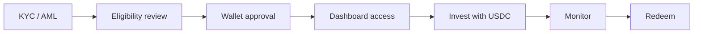

Setmos access begins with onboarding. Users do not receive unrestricted access to products until eligibility, jurisdiction, compliance, and wallet checks are complete.

## Flow

## 1. Request access

Users begin by requesting demo or onboarding access. Setmos may request basic profile information, jurisdiction, investor type, entity details, and intended product access.

## 2. Complete KYC / AML

Users may be required to complete identity verification, entity verification, beneficial ownership review, sanctions screening, wallet screening, and related compliance checks.

## 3. Qualify for product access

Access depends on investor type, jurisdiction, product availability, issuer requirements, and onboarding review. Some products may be available only to non-US users, qualified investors, institutional users, or users who satisfy specific product-level criteria.

## 4. Connect an approved wallet

Wallets may be subject to allowlisting, transfer controls, sanctions screening, and ongoing monitoring. High-risk wallets or wallet-linked activity may be restricted.

## 5. Invest and monitor

Approved users can review available Set options, APY or price metrics, fund size, settlement rail, and allocation views. Settlement is designed around USDC.

## 6. Redeem

Redemption availability, timing, and mechanics vary by product, issuer, liquidity profile, and governing documents. The dashboard may show estimated or product-level redemption information, but final treatment is controlled by product documents.
