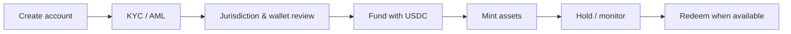

Setmos is designed to make premium real-world asset categories available through a clear onchain product flow.

## Flow

```mermaid
flowchart LR
  A["Create account"] --> B["KYC / AML"]
  B --> C["Jurisdiction & wallet review"]
  C --> D["Fund with USDC"]
  D --> E["Mint assets"]
  E --> F["Hold / monitor"]
  F --> G["Redeem when available"]
```

## 1. Create an account

Users begin by requesting access and creating a Setmos account. Setmos may request profile information, jurisdiction, wallet details, entity details, and intended product categories.

## 2. Complete KYC / AML

Users may be required to complete identity verification, entity verification, beneficial ownership review, sanctions screening, wallet screening, and related compliance checks.

## 3. Review product availability

Product availability may depend on jurisdiction, onboarding status, product category, wallet policy, sanctions review, and product requirements.

## 4. Fund with USDC

Setmos is designed around USDC settlement for launch products. Funding mechanics may vary by product and supported rail.

## 5. Mint and monitor assets

Users can review available products, yield or price metrics, fund size, settlement rail, network, and allocation views through the Setmos app.

## 6. Redeem

Redemption availability, timing, and mechanics vary by product category. Final treatment is controlled by product documents, liquidity mechanics, wallet controls, and applicable law.

## Beyond yield

Setmos assets are designed to become usable as collateral across selected DeFi venues and protocols, subject to integration and risk review.
